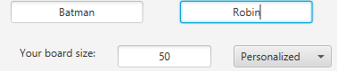
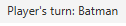
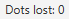
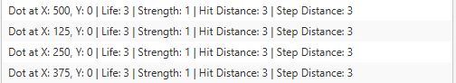
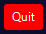
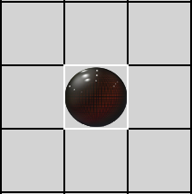
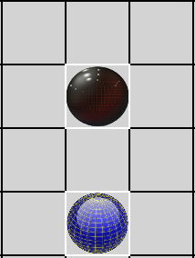

# DotWars

  

### Dot Wars is a game that can be played by two players. 
### In the game, both players will fight to destroy every opponent's dot that can destroy their dots.
### This will be accomplished by moving your dots strategically, in order for them to not be damaged, but for you to attack.

## Inside the game

### Once the app is running:

- Both players must type their names.
- A board size must be selected from the default options, or typed in the personalized option.
- Once all this data has been provided, you can go ahead and click the **Begin new game** button.
- Example of data:

  

### Once the game has begun:

- The game will indicate which player's turn is up. 
- It will also indicate the amount of dots that have been killed. 
- As well as the information of the dots. 
  
  

- The player whose turn is to play will have various options during it's turn, such like:
    - Quit the game 
    >The game will finish and the player who chose to quit the game, will lose.
    - Save the current state of the game 
    >You must select the folder where the game will be saved and provide a name for it.
    - Load an existing state of a game 
    >If you load a game, your current game will be lost if it was not saved before.
    >You will explore your files and select the game you want to resume.
    - Restart the current game 
    >Restarting a game will take the game to its initial state where there were no moves or attacks done

# How To Play?

- When your turn to play arrives, you will have two actions to perform and two options for each action:
1. Play: you get to move a dot and attack an enemy dot.
   - ### Move
      - Click on the button:  
      - Choose a dot to be moved:
     
  

      
      - Using the arrow keys on your keyboard, move your dot to the desired position.
   - ### Attack
      - Click on the button: 
      - Choose a dot, the same way you chose when moving.
      - And then choose the enemy dot you want to attack:
     
  

      
      - If your enemy is within a ratio of your hit distance, you will attack it, otherwise the attack will be wasted.
2. Pass: you pass your turn to the opposite player. 

# Mana Dots
- Distributed throughout the map, are mana dots that look like this:
  
  

- If at the end of your turn, one or more dot ends positioned over one mana dot...
- ... In your next turn, those dots will gain 1 point of mana.

## Mana points

- When accumulating mana points, you will get to use them in 4 different ways.
  - Life: 
    > In order for increase your life in 1 point, you will require 1 mana point.
  - Strength: 
    > In case you want to increase your strength in 1 point you will require 2 mana points.
  - Hit Distance: 
    > To increase 1 point on your hit distance, or range, you will require 3 mana points.
  - Step Distance: 
    > And finally, to increase in 1 point your step distance, or moving steps, you require 1 mana point.

### Distributing mana points in your action

- If you want to distribute some mana points, hit the specific skill you want to improve.
- Then choose the dot that will be benefited.
  > If your dot has the minimum amount of mana points to increase your selected skill, it will proceed to do so.

  > Otherwise, the game will indicate you that the distribution of points is unavailable.

  > WARNING! The strength, the life and step distance can't be increased over 10 points.
  > So if the skill is at its maximum level, the distribution will remain unavailable in this case, too.

# Rules

 - You can't attack with a dot that is standing on top of a mana dot.
 - Chess rule: Action selected and dot selected, must be finished. You can´t cancel the action.

## Release notes Version 3.0 - 11/06/2022:
1. The current version has its entire functionality coded in its graphic user interface, but hopefully we'll fix that, soon.
2. The dot character is preassigned, you can't choose your character, yet.
3. Some bugs to fix:
   - The in game sounds sometimes don't work or don't stop when they are supposed to, as the case of the ambiance music.
   - There's a very annoying bug in the current version, which is that you can't have two of your own dots in the same row.
   - When you try to do this, one of your dots will disappear from the game.
4. The ambiance music can't be changed or stopped.
5. The turn to start playing will always be for the player 1.
6. The player 1 will always use the top dots.

# References

  - [GameOfLifeSimulator](https://github.com/Tyjoh/GameOfLifeSimulator/tree/79321ae11426264cde9eeb061aeff7e3b98c26d0) (GitHub, 2019)
  - [Basic Syntax, Markdown](https://www.markdownguide.org/basic-syntax/) (Markdown Guide)
  - [JavaFX Button](https://jenkov.com/tutorials/javafx/button.html) (Jenkov.com, 2020)
  - [JavaFX: how to clear a drawing without affecting background](https://stackoverflow.com/questions/46987852/javafx-how-to-clear-a-drawing-without-affecting-background) (StackOverFlow, 2017)
  - [Traverse Through a HashMap in Java](https://www.geeksforgeeks.org/traverse-through-a-hashmap-in-java/) (GeeksForGeeks)
  - [How to break out or exit a method in Java?](https://stackoverflow.com/questions/7937029/how-to-break-out-or-exit-a-method-in-java) (StackOverFlow, 2011)
  - [GoTo Next Iteration in For Loop in java](https://stackoverflow.com/questions/11160952/goto-next-iteration-in-for-loop-in-java) (StackOverFlow, 2012)
  - [JavaFX Uso de ComboBox](http://acodigo.blogspot.com/2015/04/javafx-uso-de-combobox.html) (http://acodigo.blogspot.com, 2015)
  - [javafx ComBobox add listener on selected item value](https://stackoverflow.com/questions/41323945/javafx-combobox-add-listener-on-selected-item-value) (StackOverFlow, 2016)
  - [JavaFX combobox, on item clicked](https://stackoverflow.com/questions/41654389/javafx-combobox-on-item-clicked) (StackOverFlow, 2017)
  - [Memento in Java](https://refactoring.guru/design-patterns/memento/java/example) (Refactoring.Guru)
  - [What's the syntax for mod in java](https://stackoverflow.com/questions/90238/whats-the-syntax-for-mod-in-java) (StackOverFlow, 2008)
  - [Java KeyListener Not Registering Arrow Keys](https://stackoverflow.com/questions/8961938/java-keylistener-not-registering-arrow-keys) (StackOverFlow, 2012)
  - [Java: using switch statement with enum under subclass](https://stackoverflow.com/questions/10161408/java-using-switch-statement-with-enum-under-subclass) (StackOverFlow, 2012)
  - [How to display an image in JavaFX?](https://www.tutorialspoint.com/how-to-display-an-image-in-javafx) (Tutorials Point, 2020)
  - [Cómo calcular el valor absoluto en Java](https://geekytheory.com/como-calcular-el-valor-absoluto-en-java/) (Geeky Theory, 2014)
  - [How do I display local image in markdown?](https://stackoverflow.com/questions/41604263/how-do-i-display-local-image-in-markdown) (StackOverFlow, 2017)
  - [JavaFX DirectoryChooser](https://jenkov.com/tutorials/javafx/directorychooser.html) (Jenkov.com, 2019)
  - [26 File Chooser](https://docs.oracle.com/javafx/2/ui_controls/file-chooser.htm) (Oracle)
  - [JavaFX FileChooser](https://jenkov.com/tutorials/javafx/filechooser.html) (Jenkov.com, 2019)
  - [Group: FasterXML Jackson Core](https://mvnrepository.com/artifact/com.fasterxml.jackson.core) (Mvn Repository)
  - [fasterxml.jackson.databind Invalid Definition Exception](https://stackoverflow.com/questions/58411455/fasterxml-jackson-databind-invalid-definition-exception) (StackOverFlow, 2019)
  - [Class GraphicsContext](https://docs.oracle.com/javase/8/javafx/api/javafx/scene/canvas/GraphicsContext.html) (Oracle)
  - [Define a relative path of image in Java FX](https://stackoverflow.com/questions/27446360/define-a-relative-path-of-image-in-java-fx) (StackOverFlow, 2014)
  - [Issue loading relative path of image in javafx](https://stackoverflow.com/questions/36217597/issue-loading-relative-path-of-image-in-javafx) (StackOverFlow, 2016)
  - [How to generate random numbers in Java](https://www.educative.io/edpresso/how-to-generate-random-numbers-in-java) (Educative.io)
  - [How to print elements of a Stream in Java 8](https://www.geeksforgeeks.org/how-to-print-elements-of-a-stream-in-java-8/) (GeeksForGeeks, 2018)
  - [Java break Statement](https://www.programiz.com/java-programming/break-statement) (Programiz.com)
  - [How to play sounds with JavaFX](https://stackoverflow.com/questions/23202272/how-to-play-sounds-with-javafx) (StackOverFlow, 2014)
  - [JavaFX Media » 13](https://mvnrepository.com/artifact/org.openjfx/javafx-media/13) (Mvn Repository)
  - [JavaFX MediaPlayer loop](https://stackoverflow.com/questions/43190594/javafx-mediaplayer-loop) (StackOverFlow, 2017)
  - [How to set placeholder in JavaFX?](https://stackoverflow.com/questions/23363222/how-to-set-placeholder-in-javafx) (StackOverFlow, 2014)
  - [How to set alignment in a JavaFX TextField?](https://stackoverflow.com/questions/8399026/how-to-set-alignment-in-a-javafx-textfield) (StackOverFlow, 2011)
  - [Resize image in the wiki of GitHub using Markdown](https://stackoverflow.com/questions/24383700/resize-image-in-the-wiki-of-github-using-markdown) (StackOverFlow, 2014)
  - [How do I center an image in the README.md file on GitHub?](https://stackoverflow.com/questions/12090472/how-do-i-center-an-image-in-the-readme-md-file-on-github) (StackOverFlow, 2012)