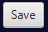
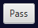

# DotWars

### Once the app is running:

- Both players must type their names.
- A board size must be selected from the default options, or typed in the personalized option.
- Once all this data has been provided, you can go ahead and click the **Begin new game**
- Example of data:

### Once the game has begun:

- The game will indicate which player's turn is up. 
- It will also indicate the amount of dots that have been killed. 
- As well as its dots information. 
- 
- The player whose turn is to play will have various options during it's turn, such like:
    - Quit the game 
    - Save the current state of the game 
    - Load an existing state of a game 
    - >If you load a game, your current game will be lost if it was not saved before.
    - Restart the current game 
    - >Restarting a game will take the game to its initial state where there were no moves or attacks done

# How To Play?

- When your turn to play arrives, you will have two options:
1. Play: you get to move a dot and attack an enemy dot.
   - ###Playing
      - Moving: 
2. Pass: you pass your turn to the opposite player. 

# Movement

- To move your dots use the key arrows
