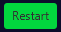

# DotWars

  

### Dot Wars is a game that can be played by two players. 
### In the game, both players will fight to destroy every opponent's dot that can destroy their dots.
### This will be accomplished by moving your dots strategically, in order for them to not be damaged, but for you to attack.

## Inside the game

### Once the app is running:

- Both players must type their names.
- A board size must be selected from the default options, or typed in the personalized option.
- Once all this data has been provided, you can go ahead and click the **Begin new game** button.
- Example of data:

  

### Once the game has begun:

- The game will indicate which player's turn is up. 
- It will also indicate the amount of dots that have been killed. 
- As well as its dots information. 
- 
  

- The player whose turn is to play will have various options during it's turn, such like:
    - Quit the game 
    - >The game will finish and the player who chose to quit the game, will lose.
    - Save the current state of the game 
    - >You must select the folder where the game will be saved and provide a name for it.
    - Load an existing state of a game 
    - >If you load a game, your current game will be lost if it was not saved before.
      > You will explore your files and select the game you want to resume.
    - Restart the current game 
    - >Restarting a game will take the game to its initial state where there were no moves or attacks done

# How To Play?

- When your turn to play arrives, you will have two actions to perform and two options for each action:
1. Play: you get to move a dot and attack an enemy dot.
   - ### Move
      - Click on the button:  
      - Choose a dot to be moved:
     - 
  

      - Using the arrow keys on your keyboard, move your dot to the desired position.
   - ### Attack
      - Click on the button: 
      - Choose a dot, the same way you chose when moving.
      - And then choose the enemy dot you want to attack:
     - 
  

      - If your enemy is within a ratio of your hit distance, you will attack it, otherwise the attack will be wasted.
2. Pass: you pass your turn to the opposite player. 

# Mana Dots
- Distributed throughout the map, are mana dots that look like this:
 > 
  

- If at the end of your turn, one or more dot ends positioned over one mana dot...
- ... In your next turn, those dots will gain 1 point of mana.

## Mana points

- When accumulating mana points, you will get to use them in 4 different ways.
  - Life: 
    > In order for increase your life in one point, you will require 1 mana point.
  - Strength: 
    > In case you want to increase your strength in one point you will require 2 mana points.
  - Hit Distance: 
    > To increase your hit distance, or range, you will require 3 mana points.
  - Step Distance: 
    > And finally, to increase in one point your step distance, or moving steps, you require 1 mana point.

### Distributing mana points in your action

- If you want to distribute some mana points, hit the specific skill you want to improve.
- Then choose the dot that will be benefited.
  > If your dot has the minimum amount of mana points to increase your selected skill, it will proceed to do so.

  > Otherwise, the game will indicate you that the distribution of points is unavailable.

  > WARNING! The strength, the life and step distance can't be increased over 10 points.
  > So if the skill is at its maximum level, the distribution will remain unavailable in this case, too.
